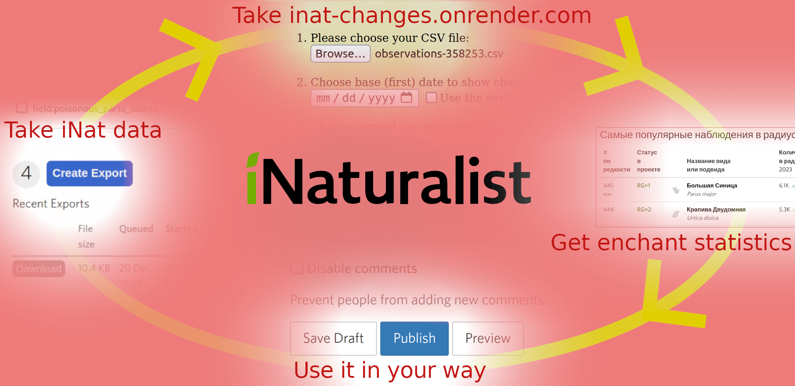
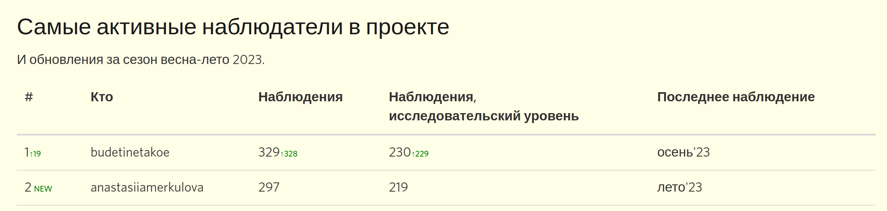
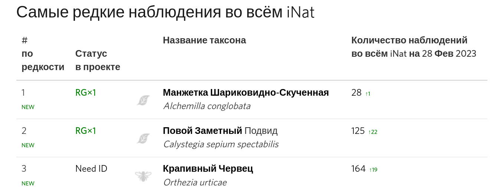

# iNat-statistics

This repository is common place for set of programs for iNaturalist.org users.

## iNat-changes
  

This utility catch **user activity changes** in your iNat project or in **list of any iNat observations**. It creates html table, ready to publish to iNat journal post.  
How it does actually look you can see in one of my own regular posts about [half-year project changes].

Please **wait up to 60 sec** till page at [inat-changes.onrender.com](https://inat-changes.onrender.com) will be loaded. It is free hosted.

</img>

[half-year project changes]: https://www.inaturalist.org/projects/tsyurupy-i-ego-lesa/journal/75862-2023

Flask online-app with core script `inat_changes.py`.  

#### Features

* Specifying first and second date to see changes. It means, you can export observations for the whole period, but look for changes in interesting (_current_) period:  
</img>

* **List of most active users**. Sorted by next order: *Total count of observations* **->** *Research grade count observations* **->** *Most recent observations* **->** *Username*

* **Observations count increase**: both total or research. Look at 3rd, 4th column in first line:
</img>

* **Position increase**: above you can see, for current period user *budetinetakoe* became first after being second. Position decrease is not shown

* «**New user**» marks: user *anastasiiamerkulova* above first appeared in current period

* **Season of user's last observation**

* Specifying **number of lines** in the final table

* **Links** to observations: if you provide project name, app will generate link to easy observation access

* Ready-to-paste for iNat journal. Just save html file and open it in text editor. All the text can be pasted to post

#### Disadvantages — ideas to development

* Russian language of headers and seasons without choice

* No statistics about observations: current period / total users / total observations

## iNat-raritets

 

*inat_raritets.ipynb*  

Utility that automatically load info about geographical distribution of the species and prepares result in handy table. All results of request to API are saved to text file for automatic reusing.

It work in two modes: **rarest species** and **the most popular species**. This are almost same tables, but sorted in opposite order (the difference is: _most popular_ consist only species AND subspecies, but no any other taxon levels: genus, kingdom and etc; _rarest_ table consist all taxon levels).  

Example of most popular table from my [post](#afritets-inat-journal):

</img>

This list sorted from most popular to rarest species in radius of 200 km around of my small town. Take a look at first column, it show "position by rarity"

#### Explanation

* For each of modes script will prepare **three tables**: 
    - 20 km 
    - 200 km 
    - 2000 km,
    - 0 km,

    i.e. six tables in total. This lenghts is the radiuses of the circle with center as some given geographical point. This point can be, for example, your home or your city main square. **0 km is whole world**, i.e. no radius at all (_yes, this number should be infinity or at least diameter of Earth, but zero is simpler to type!_). 

* Each of tables will include _only_ the species **that present in given csv file**. So what app do? It look, which of these species are rarest or most popular in this circles.

    If your csv contains 1000 observations and **500** taxons, app will make this count of API requests:
    
500 taxons x 4 radiuses x 2 dates = <b>4000</b> requests

    Each request will give information about how much observations of given taxon exist in given area at given date.

* It includes 2 dates, because app can display **how much new observations** we have in the circles, i.e. dynamics of observation. If you're not interesten in dinamics, just specify first date as first observation date

* Table will consist both research grade and non-research observations. Filter it by yourself before import if needed.

#### Features

* Display the **number of research grade observations** in the given list.

    Look at example: rarest table from my [half-year report](#raritets-inat-journal]), in second column. 

    </img>

* **Number of new observations** of given species in that region. For example, for a given period of time (half of a year) there is only one new obs of _Alchemilla conclobata_ in the whole world

* «**New observation»** marks: for example, we can see there was no any _Alchemilla conclobata_ observations in project before this period of time thanks to `NEW` mark. By the way, in that particular case (`NEW` and  ↑1)we can say that for given period of a time the single obs of this species is observation in our list.

* **Taxon level** for all non-species taxons: genus, subspecies, and etc. You can see this in second line of table above

* **Latin names** and **common names** where it possible (some taxons have no common names)

* **Iconic taxon icons** between second and third columns. Iconic taxons are groups of organisms that iNaturalist define by yourself: birds, amhibians... You can see these icons in filter dialog on iNat

* **Database** of loaded data. Loaded date saves to csv with fields: `taxon_id`, `radius`, `date`, `count`. For example, if you monitor changes every month, you need no load info about observations counts for last month — they are already load and saved month ago and will be loaded automatically.  
_**Notice**: database not saves geographical points that regards to counts, so you have to manage this on your own. It is subject of TODO (you can make pull request too)._

* Human-readable format of counts (K for thousands, M for millions)

#### Disadvantages — ideas to development

* Jupyter notebook format. No app at this time, because it needed to rewrite to sql-database and it takes time

* Russian language in headings without choice

* No totals, no notes on current periods

* Specifying of radiuses, coordinates in code

* Plain database without coordinates column

## Contributing

If you wish to make code contributions to the project, you are welcome! Make pull requests, open issues, write me on iNat with ideas. This project certainly have future

🪡🦄🦋🐌🐞🐜🐢🦂🕸🕷🦗🦟🪳🪲🪰🐡🐠🐏🐫🐖🐈🪽🐀🎄🌵🍂💐🪨🐚🪹🌾🌷🌳🍄🍄🍄🍄🍄🍄🦩

[raritets-inat-journal]: https://www.inaturalist.org/projects/tsyurupy-i-ego-lesa/journal/75866-osen-vesna-2022-23-samye-redkie-vidy/

[afritets-inat-journal]: https://www.inaturalist.org/projects/tsyurupy-i-ego-lesa/journal/75872-osen-zima-2022-23-samye-populyarnye-vidy